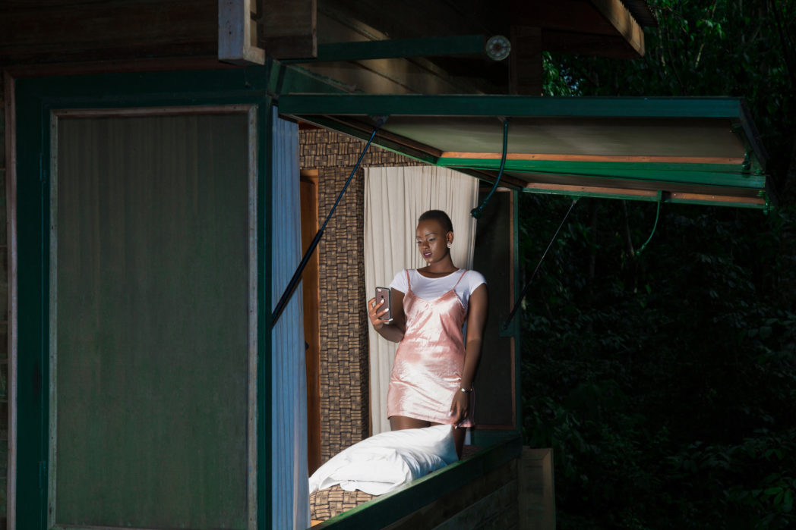
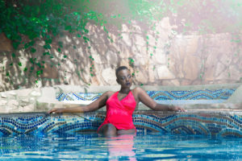

  

    

      

        If you are looking for a nearby paradise look no further than the Rain Forest Lodge , it has a genuine rain forest environment enriched  with orchids , birds , rare forest plants , monkeys  and more .Located in Mabira forest up on a hill 2km off the main road , 60 km from Kampala and from Jinja  it’s just  20 km away .The forest walks are so refreshing with a guide for only $10 per person , be sure to look out for a guide called Hajji , this gentleman has an impressive wealth of knowledge about nature to share following his 20 years of stay in the forest .
      

    

    

      
    

  

  

    

      
    

    

      

        On request by a guest the lodge can arrange for adventurous activities like zip lining , bungee jumping, rafting and mountain biking at a cost .The lodge has 12 individual cabins each with ensuite facilities and an individual forest viewing deck , I for one was accommodated in the dellevoet suite which has an alluring infrastructural design mainly made of wood which gave me an African authentic feel .
      

    

  

  

    And for my fellow foodies , worry not , the lodge has extraordinary chefs , I was personally attended to by chef Melissa , she was brilliant I tell you , her menus ; two starters , a four main course meal  to choose from and two desserts – for lunch and for dinner – offered a variety which made it a  task  at selection.
  

  

    

       
    

    

      

      Did I mention how beautiful their pool is ,I laid by the pool catching a glimpse of monkeys swinging from tree to tree , and the sound of the birds kept my ears entertained , also a great view for photos , for those like me who love to keep digital memories the Rain Forest pool area will provide a great back ground , what makes it better is that the sauna and pool are all on the house . You can have a soothing massage for only $30 to untangle all your knots from the forest walks and long day of activities .
      

    

  

  

    

      
    

    

      

        I loved that it was so easy to locate the lodge , very friendly staff everyone was kind and calm , great food , and so cosy , it would be a good idea to even just call in and arrange a private lunch for your loved one , how romantic , somewhere out of town so serene  and beautiful surrounded by true nature .
      

      

      At $250 for residents and $330 for non residents you can get a full board package . For only one night for two guests Check out for more offers and information by calling <strong>+256754067015</strong>
      

    

  

