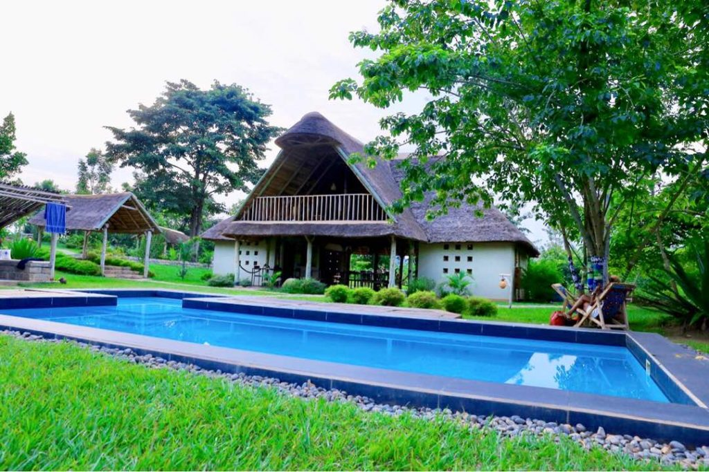
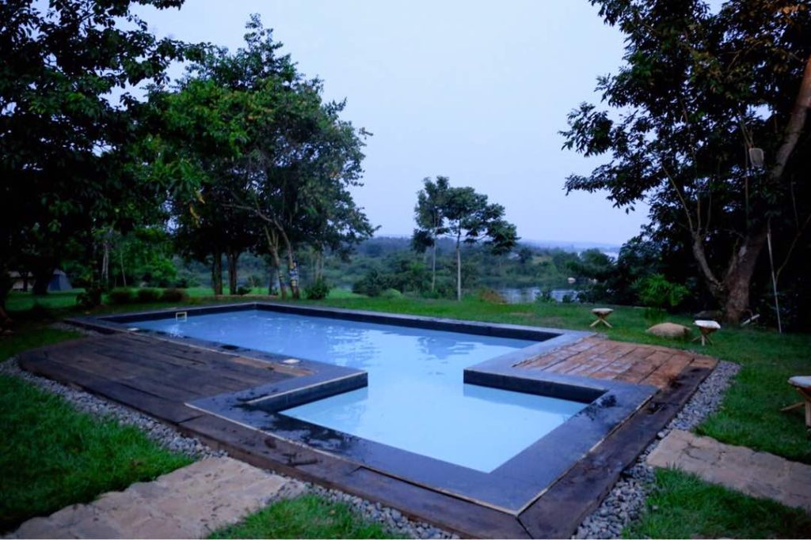
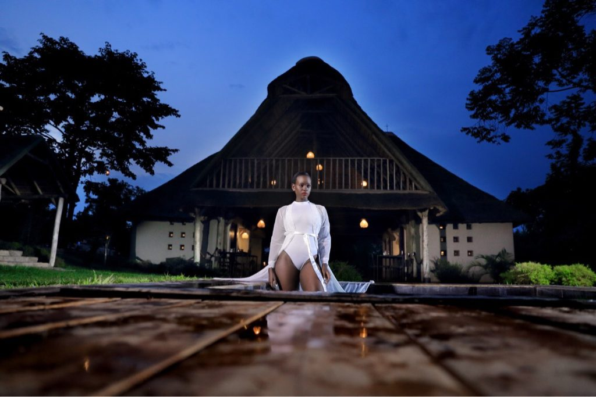
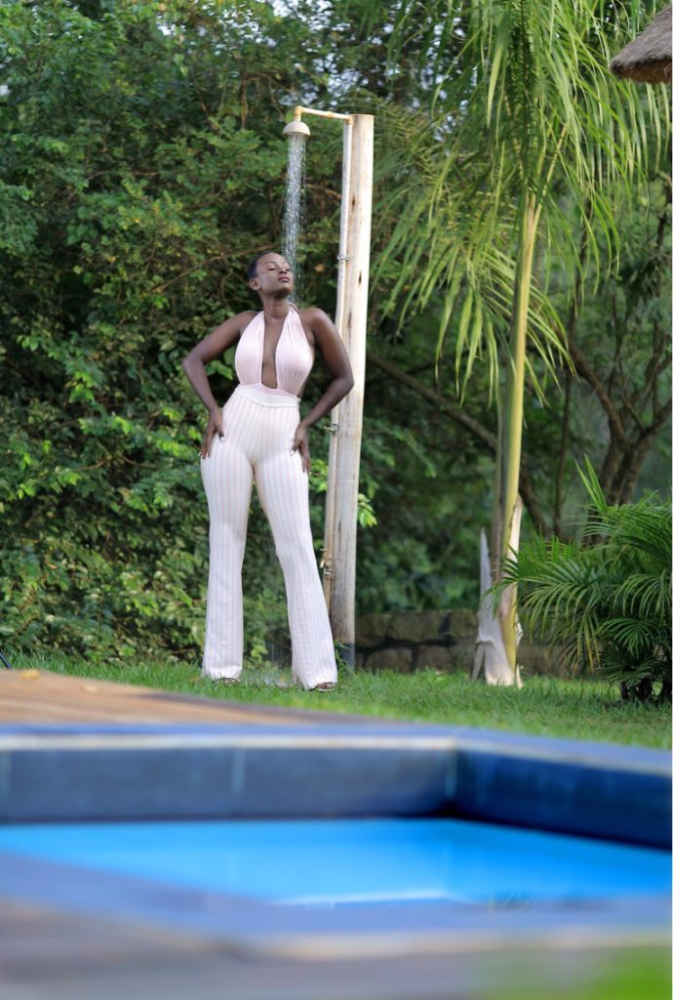

Its well known knowledge that a large share of some of
the non residents who came to this country are driven by what is
currently termed as poverty porn .
This trend belittles the significance of the many stunning and monumental places in the country once famously described as the pearl of Africa.

  
 
  I postponed my Europe tour so as to exhibit some of Uganda’s beautiful nature and magnificent scenery.
  My first take over was Jinja at the beautiful Kipling lodge a boutique lodge nearly 2 years old located in Kangulumira , surrounded by the beautiful river Nile and its verdant jungle estate which is home to more than a hundred species of birds , vervet , monkeys , iguanas and otter
  

  
    
 
  Its five exclusive cottages each named after a wild animal are breathtaking and so uniquely designed.
  I stayed in one named Gorilla which faces the Nile , what a view it was , the gushing of water , the chirping of birds , one thing for sure , Alex , the lodge owner has an eye of detail he added a Ugandan /African touch ( ankara design ) to everything from the shower , the bathtub outside by the pool, the tree trunks in the compound .
    

  

  And oh If you are foodie , you don’t have to worry about missing home food , the Kipling lodge should be your spot , such an amazing chef , I am on diet at the moment but was swayed into having everything that was prepared from Baloo’s kitchen ,from the mouth watering steak to the fresh dessert , for a second I was considering taking cooking lessons during my stay at the lodge.
  

  

    I loved how humble the lodge staff were , on arrival Martha quickly asked to lend a hand with the luggage led us to the dinning for some refreshments so professional , humble and very welcoming.
  

  

    The kipling lodge for sure is one place to visit , very kid friendly with a beautiful pool , friendly lodge pet Police , Musta , and Brown to play with all day .
    So serene , so beautiful , so relaxing when you come to Uganda visit the Kipling lodge    and don’t forget to include my name if you are asked how you got to know about it lol.
  

  

    
  

  

   
  

  

   
  

   

   
  

