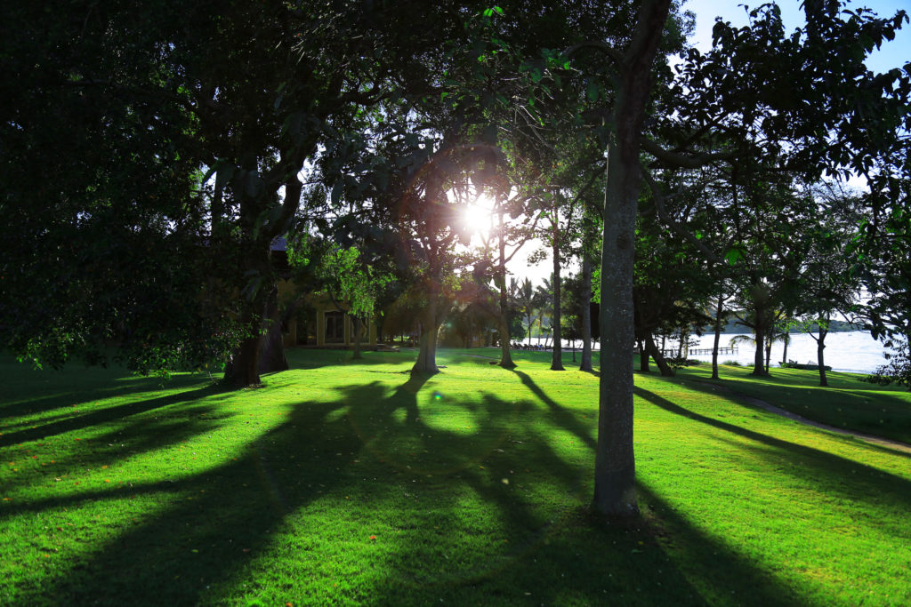
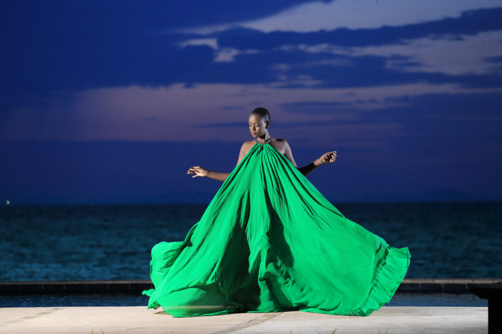
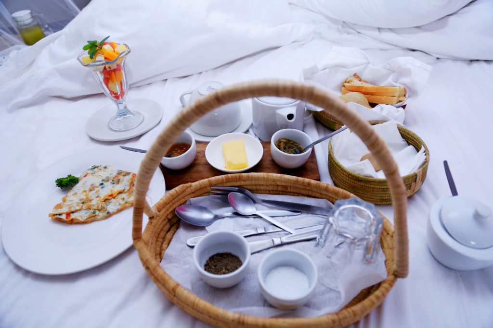
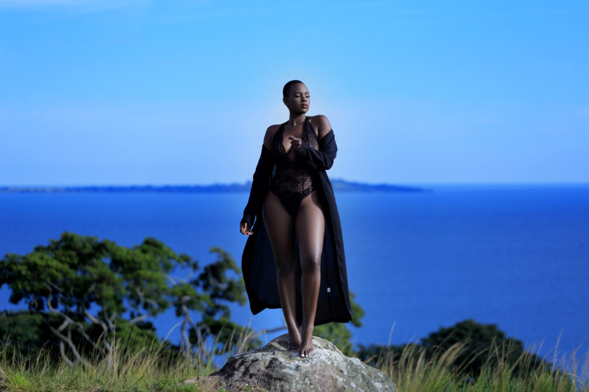
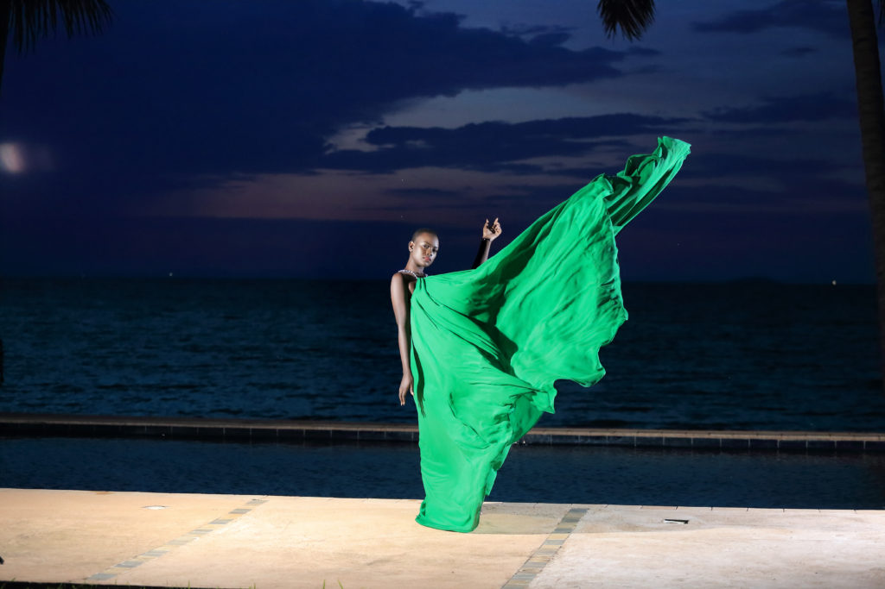

Pineapple Bay, a hidden jewel in the middle of lake
victoria on Bulago island, is a 45 minutes boat ride
from mainland Munyonyo (Kampala) and about 35 minutes
from Entebbe .

  

  
  You can decide to fly to the resort
  but I used a speed boat as I love being on water.
  By the time we got to the resort  It was almost 7 pm ,
  we had the welcome drink, the legendary pineapple juice.
  It was fresh with a taste so delicious .

  By the time we got to the resort  It was almost 7 pm , we had the welcome drink, the legendary pineapple juice. It was fresh with a taste so delicious .
  

  

    
    I could not fail to notice the white sand at the lake shore , beautiful clear and clean water so tempting for a night swim , I was advised not to as it was already getting dark , a time where crocodiles roam the waters.
    I kicked off right away with a shoot by the poolside, the back view was magnificent ,the color of the skies was unreal extremely beautiful breathtakingly so .
  

    

    
    I couldn’t let the night come before getting those perfect shots. I wore a green dress made and designed in Uganda by the gifted Fatumah Asha; Uganda’s fastest growing Designer . I slept well knowing I had secured those beautiful sunset shots.
    

    

    
    Now taking about comfort. The resort has  great rooms well furnished with an exceptional beautiful scenery that you won’t find anywhere else.The food is excellent and staff is
    so amazing and helpful. How can I possibly forget the delightful Mary . She was right by my side throughout my stay as well as our private butler Musiime Fred.
    

    

    
    My favorite moment was my last shoot on top of the hill a 2km hike . Its what they call a forest walk, such great exercise and dare I say only a real strong woman can walk up a hill and still pose for the camera pulling off a great shoot.
    

For birthdays , Honeymoons Engagements and perfect getaways from the bustle and hustle of the city  Call ***0783 989 191*** for details .Thank you so much Pineapple Bay can’t wait to be back .

<!-- 

  

    
  

  

    
  

 -->
