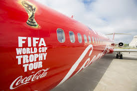

  

  

  

  

    The Coca-Cola Company has a deeply entrenched brand. For years, the company’s strategists and marketers have done incredible work defining and representing the brand across the entire world.
    So you can imagine my excitement when I was contacted by Coca-Cola Africa  — they said they were interested in working with me. Of course I agreed! How could I possibly say no to Coca-Cola? I had been hoping to be part  of the trophy tour ever since I saw an ad about it social media. This is the fourth time in history that Coca-Cola and FIFA have come together to bring the Trophy Tour to the world.
  

  

    I was ecstatic and overjoyed that my dream was actually coming true. And the cherry on top of the cake was that we would be returning from Cape Town to Uganda aboard the Coca Cola-FIFA World Cup
  

  

    
  

  

    
  

  

    
  

  

  Coca-Cola Africa picked the top influencers in Uganda out of a pool of twenty people. I emerged in the top 3 that were sent to Cape Town to come back to Uganda with the official World Cup Trophy.
  

  

    
  

  

    
  

  

    
  

  

  I flew with Kenya Airways business class to Cape Town. My flight was quite comfortable — I
  loved the service. I love traveling in comfort, so that was a bonus.
  We landed in Cape Town at around 3 pm on 4th March, and the only thing on my mind was to freshen
  up real quick and get ready for my photo shoot that I had booked  prior to my Cape Town trip.
  

  

    
  

  

      
  

  

      
  

  

    

    It was such an honor and a once in a life time chance to be part of this journey all thanks to Coca-Cola Africa.
    Football is a way of life and Ugandans love the game passionately. And being part of this tour was just so surreal.
    

  

  

    

      
    

    

       
    

     

       
    

  

  

  Being part of this journey with Coke, which is a multi-billion company, has elevated
  my status as I got numerous calls and emails from different brands
  both local and international  asking to work with me. So, that is one of the perks
  I have been blessed with because of working with Coke.
  The Coke World Cup Tour is happening  in 51 countries and 91 cities. And after this
  great experience of seeing the World Cup Trophy in real life for the first time up-close
  and personal, I can firmly say that I am ready for the FIFA  World Cup 2018 which kicks off in Russia on June 14th.
  

  

    

      
    

    

      
    

    

      
    

  
  
