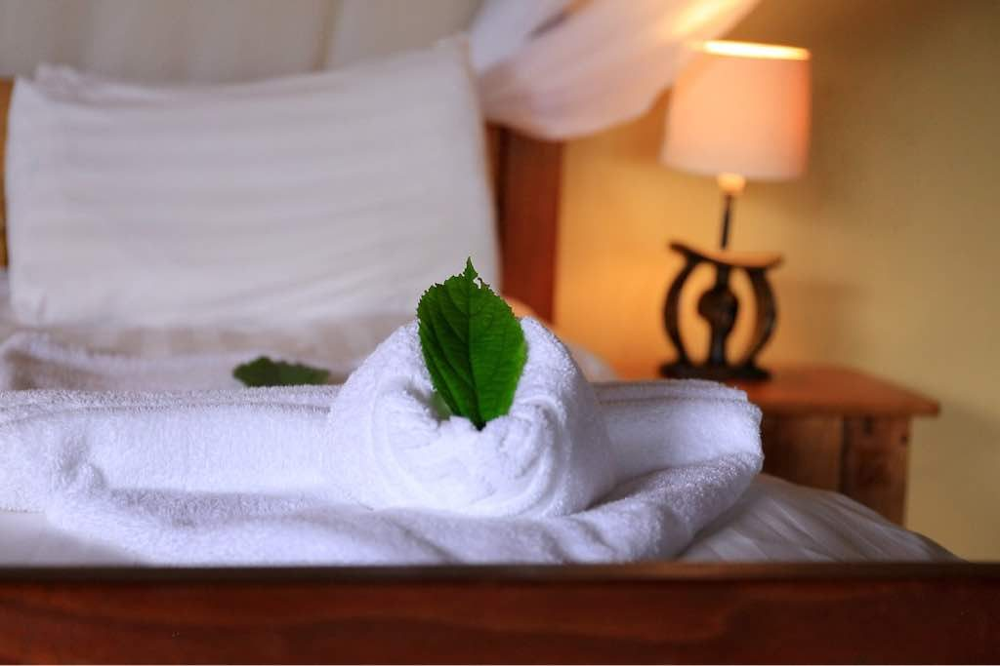
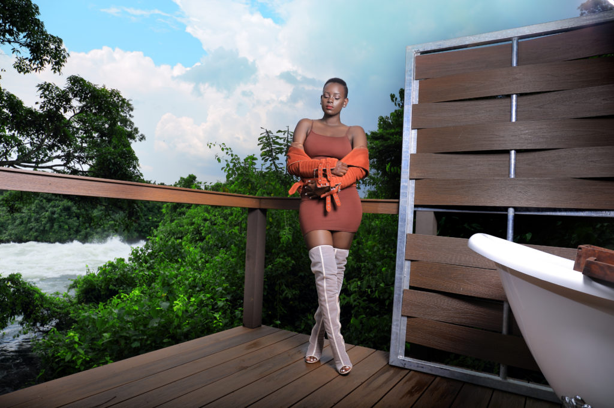
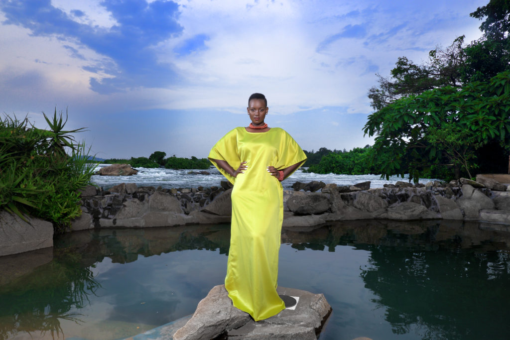
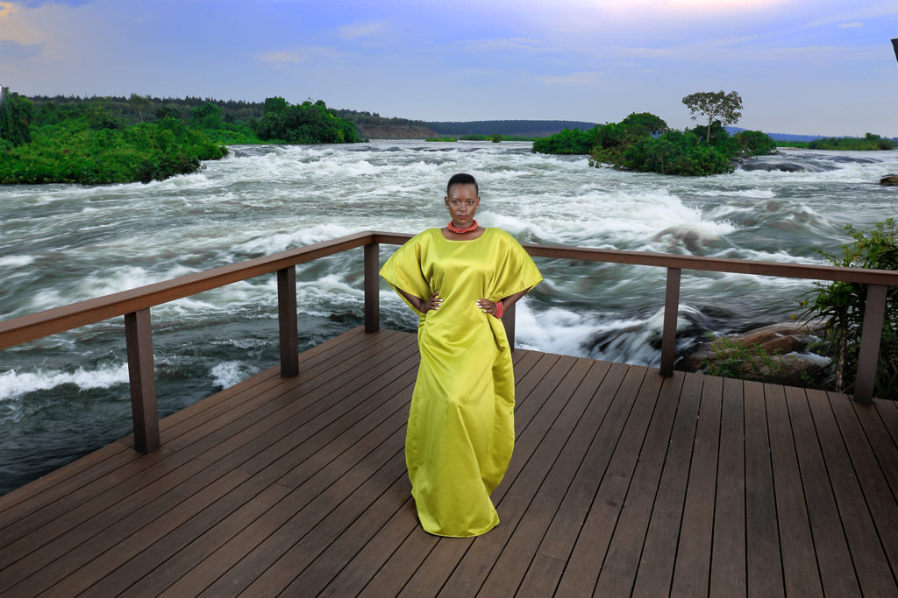
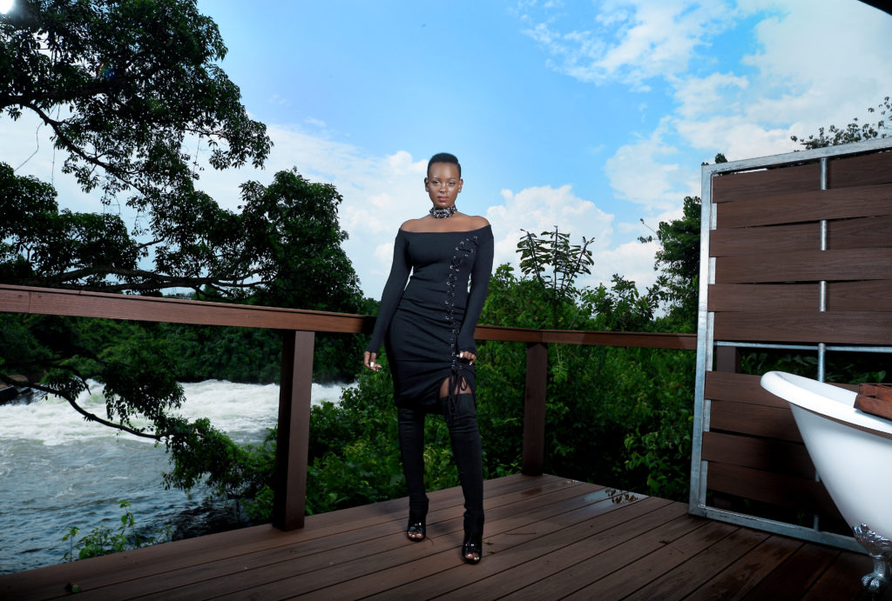

Wildwaters Lodge ,  located on a private island in
the middle of the Nile River is everything you want
for a quiet relaxing get away. The lodge can only be
accessed by a rowboat.  Me and my team arrived in
mid-afternoon  and we were warmly welcomed by the
oarsman.

  

  
  

  

   Our canoe sail was so much  fun and safe
    since a lifejacket was a must , i gazed at the thick
    riverine forest which covers the private island.
    Once on the island i was  greeted with the customary
    juice, i could not help it but stare at the rapid waterfalls , Marc Myers my contact
    to the island told me one is Itanda and the other Kalagala, i walked through the wood decked trails which  lead to the cabins  that are spread along the banks of river Nile.

   

     I was accommodated in a beautiful cabin which has the African feel as it is roof thatched with a wooden timber floor, canvas walled fully furnished, spacious and the bathroom ware which is carved from local pink granite  is a state of the art , this really caught my eye its like nothing have seen before.
  

  

     
  

    

    
    

    

        It has a private deck with an outdoor soaking tub
        where i  relaxed as i listened to the gushing of the
        rapids of the nile and the chirping of birds.
        Food enjoyed by me was simply exquisite,Chef Vincent
        and James are in a class of their own, the  dinner
        was a five course affair each course so  delicious ,
        and oh did i mention their  starters which include
        smoked fish and avocado i personally enjoyed them a
        great deal , mouth watering is the term .
    

  

    The management and staff are genuinely caring and
    attentive, and nothing is too much trouble.If you
    really want a fun luxurious adventure that is to say
    zip lining, bungee jumping , white water rafting and
    so on then Wildwaters lodge is the place.I really
    enjoyed my stay though it was for a short while but
    next time it will be a girls trip, Wild waters lodge
    see you soon.
  

  

  
  

  

    
  

  

    
  

